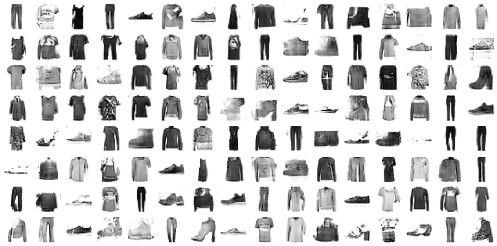

# Deep-Convolutional-GAN

In this project, I had built a Deep Convolutional Generative Adversarial Network (DCGAN) using Tensorflow framework that generates gray scale images of Fashion MNIST. I built the model using Tensorflow Sequential API that uses two sub networks which is Generator (takes in random noise and tries to transform it to the shape of the Fashion MNIST images) and Discriminator (classify between fake and real images). While training, the two sub-networks complement each other to enhance their performance. The model was trained on a Fashion MNIST dataset for 100 epochs.

In order to build this Model, I took the following steps:
  -	Imported the packages and defined a utility function that will be used in the project.
  -	Download and Prepare the Dataset
  -	Build the Model:
    -	Two sub network is used that is Generator and Discriminator
  -	Configured the Model for training 
  -	Trained the model for 100 epochs

The images that were generated by the model after 100 epochs can be seen below:

The colab notebook for this project can be found [here](https://github.com/Aryan625/Deep-Convolutional-GAN/blob/main/Deep_Convolutional_GAN.ipynb) or in this [google drive link](https://colab.research.google.com/drive/11WyolzbpJH7wrJwrzqWFCZrOLG2-59VP?usp=sharing)

